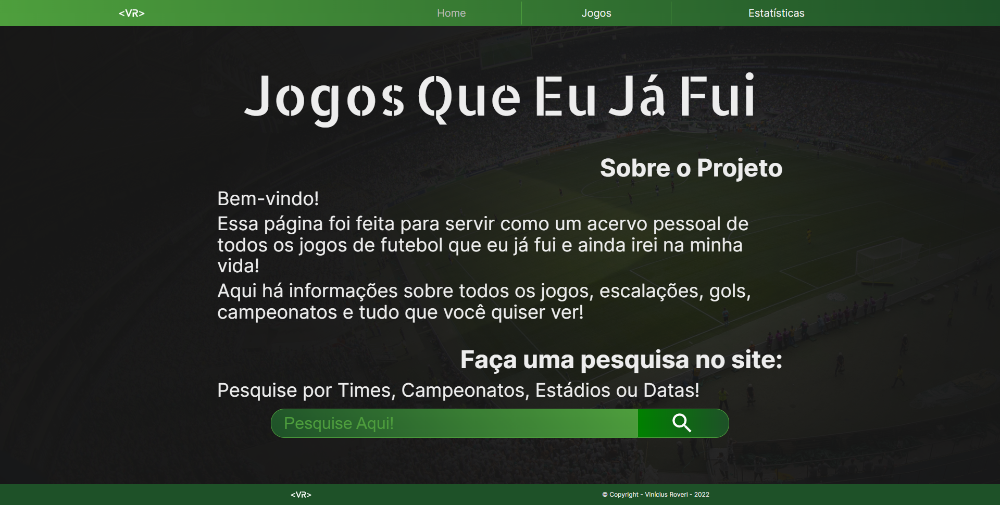

# Jogos Que Eu Já Fui ([Link do site](https://viniroveri.github.io/JogosQueEuJaFui/#/))

## O que é isso?

Um site criado usando React, TypeScript e o React Router que funciona através de uma API NoSQL que também eu mesmo criei e controlo localmente usando Express e MongoDB.

## Por que isso?

Este site foi criado para servir como um acervo de todas as informações, dados e estatísticas sobre todos os jogos de futebol que eu já presenciei na minha vida. Além de exercitar minhas habilidades de CSS para ter um produto com bom design aliado a todo o lado das animações, de React para criação de conteúdo dinâmico, e de Back-End por eu ter que criar, administrar e integrar a API que contém todas informações do site.

## Quais desafios eu tive que superar?

- ### Fazer pesquisas na Home, página de Jogos e página de Estatísticas funcionarem

O primeiro passo que eu tomei foi na página de jogos, pois eu sabia que fazendo funcionar alí bastava derivar o código nas outras páginas para elas funcionarem também.

- ##### Na página de Jogos

O caminho que eu tomei foi de capturar o input do usuário na barra de pesquisa via `useState` e a cada novo input executar uma `Função` que cria uma `Expressão Regular` com este input e usa o `RegExp.test()` em todos os textos de cards na página para identificar se há alguma correspondência. Após isso basta esconder os cards que não contém correspondências e adicionar uma mensagem de "Nenhum resultado encontrado" caso todos cards estejam escondidos, que o sistema já está 100% pronto.

- ##### Na página Home

Agora o papel era levar a pesquisa do usuário da Home para a página de Jogos. Para isso eu também capturo o input via `useState` e adiciono uma função `onSubmit` que: Copia o input do usuário para o `atom` do Recoil; Navega o usuário para a página de Jogos; Cola o input armazenado na barra de pesquisa e limpa o `atom`; Executa a função que filtra os cards usando o input recém adquirido.

- ##### Na página de Estatísticas

A lógica de capturar o input continua a mesma, porém o processo total é facilitado pela `Função` agora apenas buscar pelo nome do time e filtrar na tabela todas `tr` referentes à pesquisa, assim como lógica da mensagem de "Nenhum resultado encontrado" também continua a mesma, desta vez observando as rows da tabela ao invés de cards dos jogos.

- ### Página com todas informações de cada jogo

A lógica desta é muito parecida com a lógica de criação dinâmica dos elementos de Jogos e Estatísticas (ambos que eu vou tratar mais pra frente). O processo foi facilitado por eu ter o cuidado de criar os `objetos` na API com um `Schema` que contém todas informações necessárias para esta dinamicidade, pra isso são usados itens únicos para `strings` e `numbers`, e `Arrays` que eu preciso percorrer usando o `.map` quando se tratam de informações em bloco como escalações e informações de cada gol como seu minuto e autor.

- ### Seção de Estatísticas automatizada

Nos dados recebidos da API já era possível ter todas as informações necessárias para a tabela e o calculo de totais da página, o maior trabalho foi fazer todo este preenchimento usando o mínimo de código possível para manter o projeto limpo e eficiente.

- ##### Criar uma fileira para cada time

O primeiro passo foi criar um `array` de times, percorrendo todos os jogos e sempre que um time não estivesse, adicionando-o neste `array` final, e a partir dele usar o `.map` para retornar uma `tr` para cada time, onde seriam colocadas suas informações.

- ##### Calculo de número de jogos, resultados e gols.

Agora para cada time daquele `array` criado foi criado um `objeto` dinamicamente que iria conter as informações para preenchimento da tabela, para isso volta pra cena as informações da API. Usando o nome do time e percorrendo o `array` da API é possível identificar informações como se ele participou de um jogo, se ele era o time da casa, quantos gols ele marcou e sofreu, etc. E a partir disso são calculadas todas informações necessárias para preencher o `objeto` de cada time. Após isso basta percorrer este `objeto` e preencher dinamicamente cada `td` com sua respectiva informação.

- ##### Calculo de estatísticas totais

Com todas informações preenchidas na tabela fica mais fácil o processo de calculo total, basta ver a `length` da API para saber o número de jogos, do `array` de times para saber o número de times, e por último somar todos os gols marcados de cada time para obter o total de gols.

- ##### Classificação na tabela

Por padrão a ordem da tabela estava basicamente aleatória. Apenas usando a função `.sort()` deixava os times em ordem alfabética, porém este também não me agradou tanto. Então eu criei uma função que analisa os `objetos` que contém os dados de cada time e a partir disso faz vários `.sort()` usando como critério de desempate os dados na ordem que aparecem na tabela (Número de jogos, em casa, fora, vitórias, empates, etc...) 

- ### Cards dinâmicos na página de Jogos

Novamente foi usado o `.map` nos dados da API para retornar um `elemento JSX` que contém o display das informações básicas de cada jogo. O mais diferente foi lidar com as imagens de cada card que devem ser adicionadas dinamicamente, para isso foi necessário a integração com a pasta `public` do React, que até então só havia sido utilizada para o `index.html`.